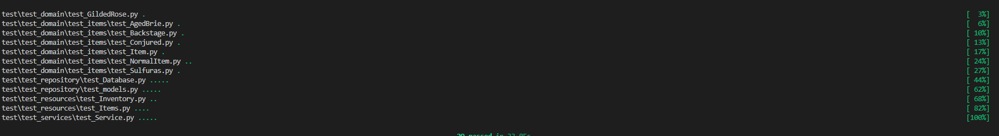
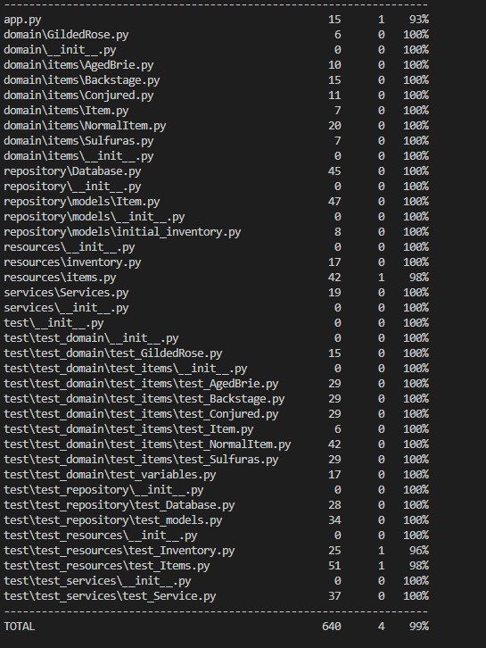

# Ollivanders Flask App

This repository contains the solution for the Ollivanders Shop exercise. It expands upon the original [statement](https://github.com/dfleta/ollivanders_shop) and [solution](https://github.com/dfleta/ollivanders) provided by our teacher, dfleta. Additional documentation can be found [here](https://github.com/dfleta/flask-rest-ci-boilerplate).

Alongside, you will find my solution to Emily Bache's [Gilded Rose Refactoring Kata](https://github.com/emilybache/GildedRose-Refactoring-Kata/tree/main/python).

This project builds on the same initial statement but incorporates a web interface and an additional REST API.

## Domain

This application simulates a magic store called "Gilded Rose" with a unique inventory. Each item has magical properties that affect how its quality changes over time. The initial inventory includes:

- Normal Items
- Sulfuras
- Aged Brie
- Backstage Passes

The exercise aims to implement SOLID principles, enabling the addition of new item categories while maintaining system integrity. Specifically, it involves adding a new item type, "Conjured," and ensuring the system correctly updates the quality of all items.

For a deeper understanding of the application, please review the following documents:

- [Application Requirements](./doc/OriginalRequirements.txt)
- [Quality Items Behavior](./doc/qualityBehaviour.txt)

## Installation

## Database Schema

The database uses MongoDB with a single collection named `items` in the `ollivander_shop` database. Each document in the collection has the following structure:

```json
{
    "_id": 1,
    "name": "Sulfuras, item of god",
    "sell_in": 5,
    "quality": 10,
    "item_type": "Sulfuras"
}
```

- `_id`: Predefined ID to uniquely identify an item.
- `name`: The name of the item.
- `sell_in`: The sell-by date.
- `quality`: The current quality of the item.
- `item_type`: The type of the item, used to categorize it.

## Tests

Development followed TDD (Test-Driven Development), with tests written for nearly every feature. Coverage was used to track testing progress.





### TOX

TOX is used to automate testing across different environments and execute commands to track test coverage.

## CI/CD

GitHub Actions and TOX are used to manage CI/CD, ensuring that tests are run and new features are properly integrated.