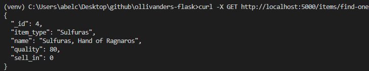

# Ollivanders flask

Start statment that our teacher dfleta prepared to us: [statement](https://github.com/dfleta/ollivanders_shop). And his [solution](https://github.com/dfleta/ollivanders). All the documentation he gave to us [here](https://github.com/dfleta/flask-rest-ci-boilerplate)

Also there will be my solution of the [refactoring kata](https://github.com/emilybache/GildedRose-Refactoring-Kata/tree/main/python) of Emily Bache. [My solution](https://github.com/ClearCB/gildedrose-kata/tree/main/python) of the previous kata without using an API REST.

The exercise that will be stored in this repository, will have the same statment but I wll create a "web" in which there will be an API REST additional at the solution.

## Domain

This application is a simulation of a magic store called "Gilded Rose" which have an specific inventory whose items have magicals behaviour. Each of them update their quality in a different way. The initial inventory stock was:

* Normal Items
* Sulfuras
* Aged Brie
* Backstage

And the kata is planned to create an application to keep SOLID principles, so we can add a new item category and keep working well (OCP principle). Since we have to add a new item called "conjured", the exercise consist in creating a logical architecture in which all the items correclty updates the quality.  

To understand the working application is important you to read the following documents: [application requierments](./doc/OriginalRequirements.txt) and [quality items behaviour](./doc/qualityBehaviour.txt)

## Install

To use this application follow this steps:

* create directory
* create venv
* !important mongodbatlas

* Clone repository

* Install requirements

* Prepare mongo atlas uri

## Use

To start the application with a file:

To start the application dockerized:


When it is ready, you can test the app with the following actions:

At the command line

### CLI

```cmd
curl -X GET http://localhost:5000/items/find-one/4
```



```cmd
curl -X GET http://localhost:5000/inventory
```

```cmd
curl -X PUT http://localhost:5000/inventory/update
```

```cmd
curl -d "{\"_id\": 15, \"name\": \"sticky stick\", \"sell_in\": 80, \"quality\": 30, \"item_type\":\"Conjured\"}" -H "Content-Type: application/json" -X POST http://localhost:5000/items/create-one
```


```cmd
curl -X DELETE http://localhost:5000/items/delete-one/15
```


```cmd
curl -d "{\"name\": \"sticky stick\", \"sell_in\": 80, \"quality\": 10}" -H "Content-Type: application/json" -X PUT http://localhost:5000/items/update-one/4
```

To test it with postman

### POSTMAN

First is important to set up the headers with the following pair key-value.

* Headers: Content-type / application/json

GET:

```postman
http://localhost:5000/inventory/
```


```postman
http://localhost:5000/items/find-one/<id>
```


POST:

```postman
http://localhost:5000/items/create-one" + json item at request
```


PUT:

```postman
http://localhost:5000/inventory/update
```


```postman
http://localhost:5000/items/update-one/4 + json with update statment
```


DELETE


## Pre-req

* Mongo DB database: is necessary to have already created an atlas cluster in mongoDB.

## Achitecture

* Repository
* Services
* Resources
* Domain
* Test

## Database schema

The DBMS used is mongoDB, non-relation database, using a unique database ("ollivander_shop") with a unique collection ("items")

```python

{
    "_id":1,
    "name":"Sulfuras, item of god",
    "sell_in":5,
    "quality":10,
    "item_type":"Sulfuras
}
```

* _id = predefined id to unique identify an item
* name = the name of the item
* sell_in = the sell in date
* quality = the actual quality of the item
* item_type = the type of the item, used to catalog it

## Test

### Unitary test

### Postman test (manual)

## CRUD

This application consist on an API with flask able to CRUD a database.

## CI/CD

github actions. keep tested and updated. development in docker container

## Dockerized

* Optional: create an image of docker in docker hub.
